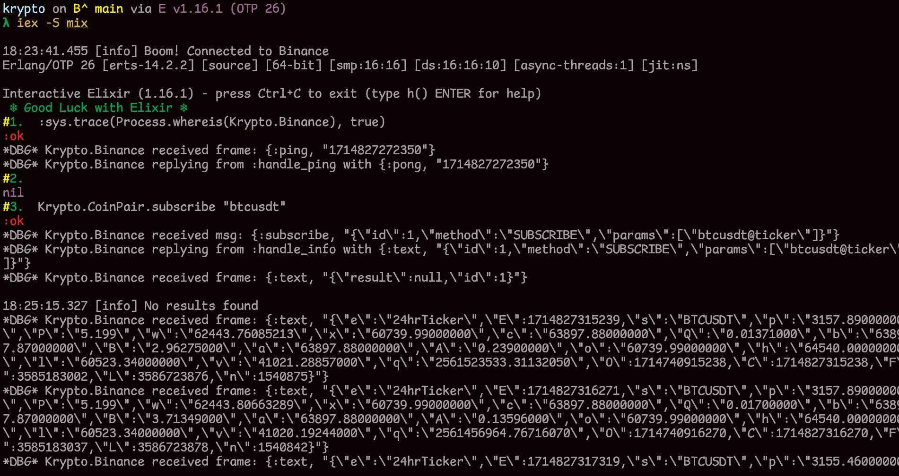

# Welcome Krypto CoinPair Average Calculator
The `Krypto.Binance` and `Krypto.CoinPair` servers are started along with application.



## Project Highlighted Module

### Krypto.CoinPair

This module simulates a Persistent Server for subscribing the coinpair and storing the prices of coinpair using `GenServer`.

It will start as soon as our `krypto` app starts.

## Development Technologies

At the moment of developing this project, I used the following versions of
Elixir and Erlang.

```elixir
iex> mix hex.info

Hex:    2.0.6
Elixir: 1.16.1
OTP:    26.2.2

Built with: Elixir 1.16.1 and OTP 24.3.4.16

```
# Running Application

## 1) mix release krypto

```
mix deps.get
mix release krypto
```

I added the releases path to `./releases` 

So, we are provided with following commands.

```
Release created at releases

    # To start your system
    releases/bin/krypto start

Once the release is running:

    # To connect to it remotely
    releases/bin/krypto remote

    # To stop it gracefully (you may also send SIGINT/SIGTERM)
    releases/bin/krypto stop

To list all commands:

    releases/bin/krypto

```

#### 2) iex -S mix

Running Interactively

## Project Challenges

- Websockex Integration (Binance) Subscription Implementation.
- CoinPair Server for subscribing and updating the coinpair prices.


## Usage of Application
When the application starts, we have two modules available. `Krypto.Binance` and `Krypto.CoinPair`. The `Krypto.Binance` establish a websocket connection as soon as the application starts.


## Subscribing a coinpair
```elixir

iex> Krypto.CoinPair "btcusdt"
:ok
iex> Krypto.CoinPair "ethusdt"
:ok

```

## Getting Average price for coinpair
```elixir

iex> Krypto.CoinPair.get_average "btcusdt"
{:ok, 64019.6706875}


iex> Krypto.CoinPair.get_average "ethusdt"
{:ok, 3150.221481481482}


```

## Debugging

```elixir
iex> :sys.trace(Process.whereis(Krypto.Binance), true)

```

## Overall Project Experience

I felt it is a well framed to test core concepts of Elixir as project made me to code in all the core concepts of Elixir like `GenServers`, `Enumaration`, `message communications`, `websocket`.

**Thank You :)**

Best Regards,      
Ankanna


